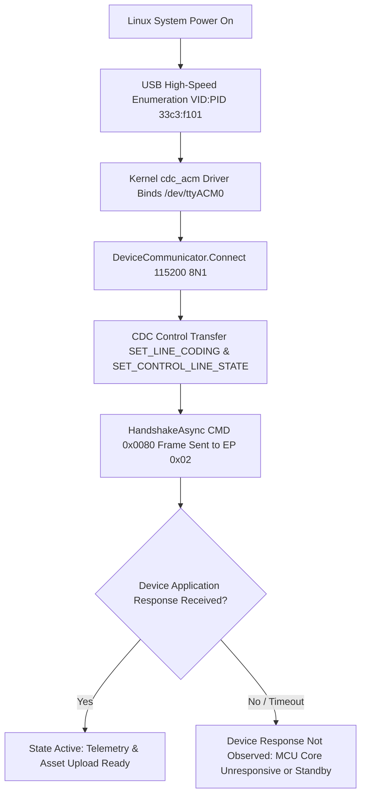

# VMAX Device Initialization State Machine

## Overview
State machine diagram of `DeviceCommunicator` and `Vmax.exe` initialization phases.

## Status
- **Current State**: `Device Response Not Observed` at Step G.
- **Investigation Focus**: Identifying missing hardware trigger / secondary MacroSilicon USB header or power rail enable.
